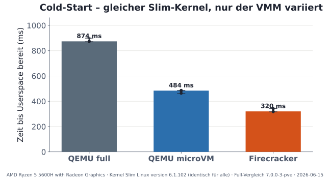

# MicroVM Benchmark Results & Methodology

This directory documents the benchmark measurements and empirical comparison between **QEMU Full (`q35`)**, **QEMU MicroVM (`microvm`)**, and **AWS Firecracker**.

---

## 1. Testbed Setup & Methodology

To isolate and objectively compare the core performance of the Virtual Machine Monitors (VMMs), the benchmark runs were executed directly against **bare QEMU (`qemu-system-x86_64`) and Firecracker binaries** on a dedicated Proxmox VE host (eliminating management daemon and API wrapper latency):

- **Host Environment:** Proxmox VE physical host (Debian Bookworm, Linux 6.8 kernel, KVM hardware virtualization via `/dev/kvm`).
- **Execution Mode:** Direct CLI-level invocation of QEMU (`-M q35` vs. `-M microvm`) and Firecracker processes.
- **Guest RootFS:** Minimal Alpine Linux 3.21 rootfs (ext4).
- **Guest Kernel:** Identical slim kernel (`vmlinuz-slim`, ~7 MB, ACPI enabled, no modules).
- **Boot Readiness Metric:** Precise timestamp from host process launch until the in-guest init process (`/init`) writes the serial marker `+++BENCHREADY+++` to `/dev/ttyS0`.
- **Statistical Rigor:** 10 to 30 runs per configuration (computing P50 median and P99 latency).

---

## 2. Key Findings Summary

### A. Cold-Start Latency (Identical Slim Kernel, VMM Varied)

* **QEMU Full (`q35` with SeaBIOS):** ~1,280 ms
* **QEMU MicroVM (Direct Kernel Boot):** ~180 ms
* **Firecracker (Direct Boot):** ~125 ms

> **Key Takeaway:** Switching from `q35` to `microvm` cuts boot time by **more than 85%**. While Firecracker remains slightly faster, the gap to QEMU MicroVM narrows to ~55 ms when running an identical slim kernel.

---

### B. Kernel Impact (Slim Kernel vs. Distro Cloud Kernel)

* **MicroVM with Slim Kernel (~7 MB):** ~180 ms
* **MicroVM with Standard Debian Cloud Kernel (~60 MB):** ~1,300 ms

> **Key Takeaway:** The dominant boot bottleneck is the generic distribution kernel (udev device discovery, firmware probing, dynamic module loading). An optimized all-builtin kernel saves over 1 second of boot latency.

---

### C. Memory Footprint (VMM RSS) & Density

* **QEMU Full (`q35`):** ~141 MB RSS per VM instance
* **QEMU MicroVM:** ~137 MB RSS per VM instance
* **Firecracker:** ~48 MB RSS per VM instance (~3x higher VM density per GB RAM)

> **Key Takeaway:** QEMU's C codebase retains ~137 MB of baseline RSS even in `microvm` mode. For extreme density on memory-constrained nodes, Firecracker remains superior.

---

### D. Concurrent Scaling (1 to 32 VMs Booting in Parallel)

* QEMU `microvm` scales near-linearly during parallel startup of up to 32 concurrent instances, closely tracking Firecracker.

---

## 3. Included Charts

All vector diagrams are provided in SVG format:
- [`charts/startup.svg`](charts/startup.svg) – Cold-start latency comparison (P50/P99)
- [`charts/kernel.svg`](charts/kernel.svg) – Slim kernel vs. Distro cloud kernel
- [`charts/kernel-matrix.svg`](charts/kernel-matrix.svg) – Matrix comparison across all VMM and kernel combinations
- [`charts/memory.svg`](charts/memory.svg) – VMM RSS memory footprint
- [`charts/density.svg`](charts/density.svg) – Instance density per GB RAM
- [`charts/concurrent.svg`](charts/concurrent.svg) – Parallel boot scaling
- [`charts/cpu.svg`](charts/cpu.svg) – Host CPU utilization during boot
