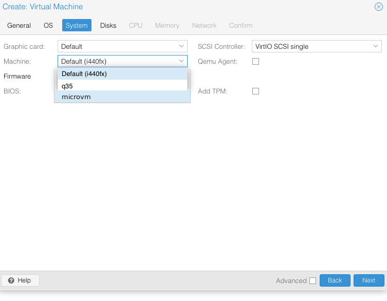
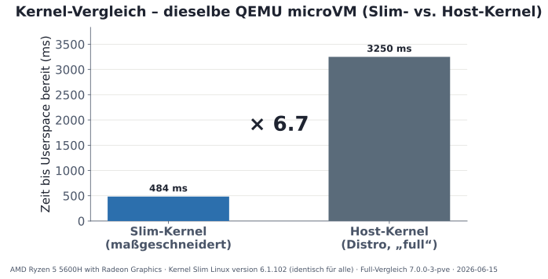
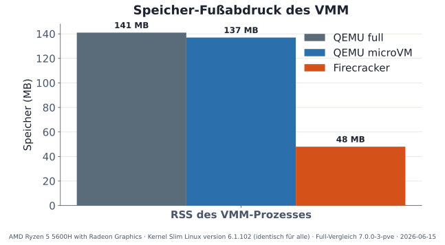
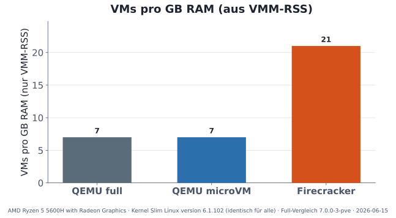
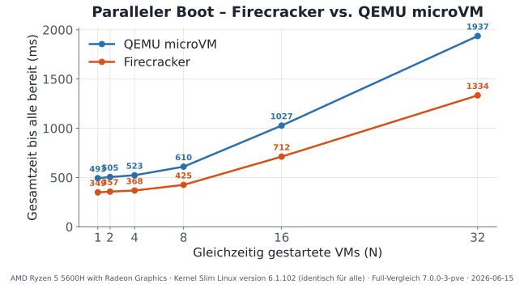

<!-- _class: title -->
<!-- _paginate: false -->
<!-- _footer: "" -->

# MicroVMs auf Proxmox VE

### QEmu on steroids 

FrOSCon 2026 · Hochschule Bonn-Rhein-Sieg · Alexander Wirt

---

## Wer bin ich?

**Alexander Wirt** – CTO und Open-Source-Entwickler

- Debian Developer seit 2002
- Arbeit bei [credativ](https://credativ.de) – Open-Source-Beratung und Linux-Infrastruktur
- Proxmox Trainer
- Schwerpunkte: Virtualisierung, Hochverfügbarkeit, Proxmox VE, Monitoring, Architektr

<div class="hint">
<strong>Wie es dazu kam:</strong> Mein Kollege Florian meinte beiläufig: „MicroVMs in Proxmox — das müsste man mal machen.“ Na ja, wie es halt so ist steh ich nun hier. Danke Florian!
</div>

---

<!-- _class: segue -->
<!-- _paginate: false -->

## Follow the white rabbit


Ein Spruch, ein Nicken in die Runde, eine Zusage — und schon war ich im Kaninchenbau.

<p class="note">Illustration: KI-generiert</p>

---

## Agenda

- **Motivation:** Die Lücke zwischen Container (LXC) und voller VM
- **Isolationsspektrum & Kandidaten:** QEMU (q35), QEMU microVM, Firecracker
- **Sicherheit:** Angriffsfläche & Isolationsgrenze gegenüber Containern
- **Wie Proxmox VMs startet:** `pve-qemu-server`, `config_to_command` & PCI-Topologie
- **Technische Hürden in PVE:** PCI-Topologie, SeaBIOS & Legacy-Geräte
- **Der Patch:** Minimal-invasive Integration in Perl-Backend & ExtJS-GUI
- **Test-Pipeline:** `.deb`-Packaging & Nested-PVE-Testbed
- **Messungen & Benchmarks:** Startup-Zeiten, VMM-RSS, Dichte & Kernel-Einfluss
- **Live-Demo:** Erstellung im Web-UI & Konsole
- **Einordnung, Grenzen & Fazit:** Wann nimmt man was?

---

## Motivation: Container vs. VM

<div class="cols">
<div>

**Container (LXC / Docker)**
- Starten in Millisekunden
- Fast kein Speicher-Overhead
- **Einschränkung:** Geteilter Host-Kernel. Ein Kernel-Exploit kompromittiert direkt den Hypervisor-Host.

</div>
<div>

**KVM-VMs (Standard PC / Q35)**
- Harte Hardware-Isolation & eigener Kernel
- Eigene Sicherheitsgrenze
- **Einschränkung:** Träge Bootzeiten (5–30 s), höherer Memory-Footprint (~140 MB RSS).

</div>
</div>

<div class="hint">
<strong>Der Anwendungsfall:</strong> Kurzlebige Workloads (CI/CD Runner, FaaS, Multi-Tenant Build-Umgebungen). Container bieten zu wenig Isolation, Standard-VMs sind zu schwergewichtig. Höhere Sicherheitsanforderungen.
</div>

---

## Was eine MicroVM ausmacht

<div class="cols">
<div>

**Eigenschaften von MicroVMs:**
- **VM-Isolation:** Eigener Linux-Kernel via KVM (harte Sicherheitsgrenze)
- **Schneller Start:** Bootzeiten von ~150–200 ms
- **Reduzierte Angriffsfläche:** Keine Emulation von Floppy, IDE, VGA, PCI oder USB – historische Quellen von QEMU-Sicherheitslücken (CVEs)
- **Schlanker Footprint:** Nur minimale VirtIO-MMIO-Geräte am Systembus

</div>
<div>

```
[ Bare Metal / Server Hardware ]
             │
             ▼
[ KVM – Linux Hypervisor (/dev/kvm) ]
             │
     ┌───────┴───────┐
     ▼               ▼
[ Volle VM ]    [ MicroVM ]
  - PCI/ACPI      - VirtIO-MMIO
  - SeaBIOS       - Direct Kernel Boot
  - VGA / USB     - Serielle Konsole
```

</div>
</div>

---

## Isolationsspektrum: Ein KVM, drei VMMs

<div class="arch-stack">
<div class="arch-box hw">Hardware / Bare Metal</div>
<div class="arch-arrow">↓</div>
<div class="arch-box kvm">KVM – Linux Kernel Hypervisor</div>
<div class="arch-row">
  <div class="arch-box vmm">QEMU<br><small>full PC (q35)</small></div>
  <div class="arch-box vmm">QEMU<br><small>microVM (-M microvm)</small></div>
  <div class="arch-box fc">Firecracker<br><small>VMM (AWS)</small></div>
</div>
<div class="arch-arrow">↓</div>
<div class="arch-box guest">Linux Gast-Kernel</div>
<div class="arch-arrow">↓</div>
<div class="arch-box guest">Workload (Prozess / App / Container)</div>
</div>

<p class="note">KVM ist bei allen dreien identisch. Sie unterscheiden sich primär im VMM (Device-Modell, Firmware, Angriffsfläche).</p>

<!--
VMM kurz erklären (erstes Vorkommen):
VMM = Virtual Machine Monitor. Das Userspace-Programm (QEMU, Firecracker, cloud-hypervisor),
das auf KVM aufsetzt: es sagt KVM "bau mir eine VM mit so viel RAM und so vielen vCPUs",
baut dem Gast die virtuelle Hardware (Platte, Netz, serielle Konsole), lädt den Kernel und
behandelt die I/O. KVM ist der eigentliche Hypervisor im Kernel; der VMM ist das Programm
drumherum. Merksatz: KVM ist bei allen drei gleich – nur der VMM unterscheidet sich.
-->


---

## Die drei VMM-Kandidaten

| Eigenschaft | QEMU full (`q35`) | QEMU microVM (`-M microvm`) | Firecracker |
| :--- | :--- | :--- | :--- |
| **Sprache / LOC** | C · ~2.000.000 Zeilen | C · ~2.000.000 Zeilen | Rust · ~50.000 Zeilen |
| **Device-Transport** | VirtIO-PCI & emuliert | **VirtIO-MMIO** | **VirtIO-MMIO** |
| **Firmware / BIOS** | SeaBIOS / OVMF | **qboot / Direct Boot** | **Keins (Direct Boot)** |
| **Emulierte Geräte** | Dutzende (PCI, USB, IDE, VGA) | **Minimal (nur VirtIO)** | **Exakt 5 Geräte** |
| **Proxmox-Integration** | Standard (nativ) | **Über Patch machbar** | Neuer VMM / Fremdkörper |

<div class="hint">
<strong>Der Punkt für Proxmox:</strong> QEMU microVM steckt bereits im <code>qemu-system-x86_64</code>, das Proxmox ohnehin mitliefert. Es braucht keinen neuen VMM, nur die Freischaltung in Proxmox.
</div>

---

## Firecracker: Das radikale VMM-Modell

<div class="cols">
<div>

### Firecracker-Design (AWS):
- **Strikter Minimalismus:** Nur 5 MMIO-Geräte, kein ACPI, kein PCI, kein BIOS.
- **REST-API-Steuerung:** Eigener Prozess pro VM, Konfiguration über HTTP/Socket.
- **Ziel:** Maximale Dichte & Sub-Sekunden-Starts für AWS Lambda und Fargate.

</div>
<div>

### Die Kehrseite in der Praxis:
- **Kein Storage-Layer:** Nur rohe Disk-Dateien (kein QCOW2, LVM, ZFS-Thin).
- **Keine Standard-Tools:** Kein QMP, kein Guest-Agent, kein Monitoring.
- **Hoher Integrationsaufwand:** Sämtliche Infrastruktur (Netzwerk, Storage, Lifecycle) muss drumherum selbst gebaut werden.

</div>
</div>

<div class="hint">
<strong>Praxiserfahrung:</strong> Mehrere Plattform-Teams, die mit Firecracker gestartet sind, wechselten für flexiblere Workloads zu QEMU/MicroVMs zurück – weil Firecrackers bewusste Reduktion außerhalb von FaaS schnell zur harten Grenze wird.
</div>

---

## Sicherheitsgrenze: microVM vs. Container

<div class="cols">
<div>

### Die harte Grenze (KVM)
- Eigener Gast-Kernel statt geteiltem Host-Kernel (LXC): ein Kernel-Bug bleibt im Gast, nicht auf dem PVE-Host.
- Angriffsfläche = wenige VirtIO-MMIO-Geräte statt des vollen PC-Modells.
- Die bekannten QEMU-Escapes liefen fast alle über emulierte Legacy-Hardware (Floppy/„VENOM", USB, NICs) – genau die fehlt hier.

</div>
<div>

### Härtung – und was PVE (nicht) tut
- **QEMU kann mehr:** seccomp via `-sandbox on`; per AppArmor ließe sich der QEMU-Prozess je VM zusätzlich einsperren.
- **Fairerweise:** Proxmox liefert dafür – anders als für LXC – **kein** AppArmor-Profil mit. Das bleibt Handarbeit und ist nicht Teil des Patches.
- Selbst mit AppArmor erreicht QEMU nicht ganz Firecrackers seccomp-Niveau (Jailer: ~50 Syscalls, Namespaces, cgroups, chroot + Rust).
- Unabhängig davon: die kleinere Gerätemenge der microVM verkleinert die Angriffsfläche ohnehin.

</div>
</div>

<div class="hint">
Der Gewinn gegenüber dem Container: microVM tauscht „geteilter Kernel" gegen eine echte KVM-Grenze — genau darum setzen FaaS-Plattformen microVMs statt Container ein.
</div>

---

## Wie Proxmox eine VM startet

```
/etc/pve/qemu-server/<vmid>.conf
               │
               ▼
   [ PVE::QemuServer::config_to_command() ]
               │
               ├── PVE::QemuServer::Machine  (Maschinentyp & Versionierung)
               ├── PVE::QemuServer::PCI      (PCIe Root Ports & Bridges)
               ├── PVE::QemuServer::Drive    (Laufwerke: SCSI, VirtIO-PCI)
               └── PVE::QemuServer::Memory   (RAM & Hugepages)
               │
               ▼
   qemu-system-x86_64 -id 100 -name vm100 ...
```

Proxmox übersetzt die deklarative Konfigurationsdatei via Perl in den exakten QEMU-Kommandozeilenaufruf.

---

## Was Proxmox standardmäßig generiert: `qm showcmd`

```bash
/usr/bin/kvm -id 100 -name vm100 -chardev socket,id=qmp,path=/var/run/qemu-server/100.qmp ... \
  -nodefaults -boot menu=on,strict=on,splash=/usr/share/qemu-server/bootsplash.jpg \
  -vga none -nographic \
  -device pcie-root-port,id=pci.1,bus=pcie.0,slot=1 ... \
  -device pcie-root-port,id=pci.2,bus=pcie.0,slot=2 ... \
  -device virtio-balloon-pci,id=balloon0,bus=pci.1,addr=0x0 \
  -device virtio-scsi-pci,id=scsihw0,bus=pci.2,addr=0x0 \
  -drive file=/var/lib/vz/images/100/vm-100-disk-0.raw,if=none,id=drive-scsi0 ...
```

**Struktur des Aufrufs:**
1. Proxmox initialisiert standardmäßig eine vollständige **PCIe-Root-Port- und Bridge-Hierarchie**.
2. Alle Geräte (`scsi`, `net`, `balloon`) werden als **PCI-Geräte (`-pci`)** an Slots gehängt.
3. Als Boot-Mechanismus wird das Standard-BIOS (SeaBIOS/OVMF) vorausgesetzt.

---

## Warum microvm in PVE nicht out-of-the-box läuft

<div class="cols">
<div>

### Was Proxmox generiert:
- PCIe Root Ports (`pcie.0`, `pci.1`, `pci.2`)
- PCI-basierte Geräte (`virtio-blk-pci`, `virtio-net-pci`)
- SeaBIOS / OVMF Bootloader
- ACPI-Power-States (`PIIX4_PM`, `ICH9-LPC`)
- Standard-Grafik & USB-Tablets

</div>
<div>

### Was `microvm` erfordert:
- **Kein PCI-Bus** (Geräte via `virtio-mmio`)
- **Kein SeaBIOS** (Direct Kernel Boot)
- **Kein klassisches ACPI** (PIIX4/ICH9), nur minimales `acpi-ged`
- **Reine serielle Konsole** (`ttyS0` / `hvc0`)
- Minimaler Device-Tree

</div>
</div>

<div class="hint">
<strong>Problem im Standard-PVE:</strong> Setzt man manuell <code>machine: microvm</code>, schlägt die Schema-Prüfung fehl, Proxmox baut PCI-Bridges für einen nicht existierenden PCI-Bus und QEMU bricht den Start mit Fehlermeldung ab.
</div>

---

## Der Patch: Architektur & Designentscheidungen

> **Voraussetzung:** Null Risiko für bestehende `pc`/`q35` VMs. Alle Änderungen greifen nur, wenn explizit `machine: microvm` konfiguriert ist.

<div class="cols">
<div>

#### Backend (`pve-qemu-server`)
- **`Machine.pm`:** Erlaubt `microvm` in der JSON-Schema-Validierung.
- **`Machine.pm`:** Führt `microvm` als eigenständigen Base-Type.
- **`config_to_command`:** Überspringt PCI-Bridge-Generierung und ACPI-Power-Flags bei MicroVMs.

</div>
<div>

#### Web-GUI (`pve-manager`)
- **`QemuMachineSelector.js`:** Fügt `microvm` zur Auswahlliste hinzu.
- **`Architecture.js`:** Erlaubt `microvm` in der x86_64-Architektur-Filterliste.
- **`MachineEdit.js`:** Verhindert Zurücksetzen auf Default.

</div>
</div>

---

## Der Backend-Patch im Detail: `PVE::QemuServer::Machine`

```diff
--- a/src/PVE/QemuServer/Machine.pm
+++ b/src/PVE/QemuServer/Machine.pm
@@ -58,7 +58,7 @@ my $machine_fmt = {
         description => "Specifies the QEMU machine type.",
         type => 'string',
         pattern =>
-            '(pc|pc(-i440fx)?-\d+(\.\d+)+(\+pve\d+)?(\.pxe)?|q35|pc-q35-\d+(\.\d+)+(\+pve\d+)?(\.pxe)?|virt(?:-\d+(\.\d+)+)?(\+pve\d+)?)',
+            '(pc|pc(-i440fx)?-\d+(\.\d+)+(\+pve\d+)?(\.pxe)?|q35|pc-q35-\d+(\.\d+)+(\+pve\d+)?(\.pxe)?|virt(?:-\d+(\.\d+)+)?(\+pve\d+)?|microvm)',
         maxLength => 40,
@@ -167,6 +167,7 @@ my sub machine_base_type {
     return 'q35' if $machine_type =~ m/q35/;
     return 'i440fx' if $machine_type =~ m/^pc/;
     return 'virt' if $machine_type =~ m/^virt/;
+    return 'microvm' if $machine_type =~ m/^microvm/;
```

**Ergebnis:** Proxmox akzeptiert `machine: microvm` in CLI, GUI und REST-API und hängt automatisch `+pve0` zur Revisionskontrolle an.

---

## MicroVM in der Proxmox Web-GUI

<div class="cols">
<div>



</div>
<div>

### Auswirkungen in der Web-GUI:
- **VM-Erstellungs-Wizard:** Machine-Dropdown bietet neben *Default (i440fx)* und *q35* nun **`microvm`** an.
- **VM-Hardware-Optionen:** Machine-Typ bleibt nach dem Speichern dauerhaft in `/etc/pve/qemu-server/<vmid>.conf` erhalten.
- **ExtJS-Kategorieprüfung:** `allowedMachines.x86_64` validiert die Auswahl fehlerfrei.

</div>
</div>

---

## Test-Pipeline: `.deb`-Build & Nested-PVE

Sicheres Testen von PVE-Patches ohne Eingriff in Produktivknoten:

```
[ Git Repo: Patch-Dateien ]
          │
          ▼  (Ansible Orchestrator)
[ 1. Build-VM: Debian Trixie / Bookworm ]
  ├── quilt push (Patches anwenden)
  └── dpkg-buildpackage -b -uc -us → *.deb
          │
          ▼  (Scp / Fetch Artefakte)
[ 2. Nested Proxmox-Test-VM (VM 9002) ]
  ├── dpkg -i *.deb
  ├── systemctl restart pvedaemon pveproxy
  └── qm showcmd & Boot-Verifikation
```

<div class="hint">
<strong>Nested-KVM-Detail:</strong> Die äußere Test-VM muss mit <code>--cpu host</code> angelegt werden, damit Hardware-Virtualisierung (<code>/dev/kvm</code>) in der inneren Test-VM ankommt.
</div>

---

## Woher kommen Slim-Kernel & RootFS?

<div class="cols">
<div>

### Slim-Kernel
- Selbst gebaut (`build-slim-kernel.sh`): Firecracker-CI-Config + `CONFIG_ACPI=y`, **alles fest eingebaut**, keine Module, kein Initramfs.
- Ergebnis: ~7 MB `bzImage` → `/var/lib/vz/template/qemu/vmlinuz-slim`.
- Direkt-Boot mit `root=/dev/vda` – kein Initramfs nötig, weil die VirtIO-Treiber im Kernel sitzen.

</div>
<div>

### RootFS
- Alpine 3.21 minirootfs → ext4-Image, als `virtio0`-Disk eingehängt.
- Für alle Messungen identisch (fairer Vergleich).

</div>
</div>

<div class="hint">
Heute landen Kernel & RootFS noch manuell auf dem Node — First-Class-Image-Handling in PVE ist einer der offenen Punkte.
</div>

---

## Benchmarks: Startup-Zeiten & Ressourcenbedarf

### Messaufbau & Methodik (reiner VMM-Vergleich):
- **Identischer Gast-Kernel:** selbst gebauter Slim-Kernel (~7 MB bzImage, ACPI=y, keine Module).
- **Identisches RootFS:** Alpine Linux 3.21 minirootfs (ext4).
- **Readiness-Signal:** Zeit bis zum seriellen Marker `+++BENCHREADY+++` aus dem Gast-Init.
- **Hinweis:** Die absoluten Zeiten variieren je nach Host-Hardware — relevant ist das relative Verhältnis der Architekturen zueinander.

---

## Cold-Start: Gleicher Kernel, nur VMM variiert


<div class="hint">
Mit demselben schlanken Kernel schmilzt der oft zitierte „Faktor 100" zusammen: QEMU microvm startet in rund <strong>180 ms</strong>.
</div>

---

## Der Kernel-Einfluss: Slim-Kernel vs. Distro-Kernel

<div class="cols">
<div></div>
<div>

### Dieselbe MicroVM – nur Kernel getauscht:

- **Schlanker Kernel (Slim):** ~180 ms
- **Standard-Distro-Kernel (Fat):** ~1.300 ms

<div class="hint">
<strong>Erkenntnis:</strong><br>
Der VMM-Wechsel (q35 → microvm) spart ~1.000 ms.<br>
Der <strong>Kernel-Wechsel spart weitere ~1.100 ms</strong>.<br><br>
Das größte Optimierungspotenzial liegt im Gast-Kernel.
</div>

</div>
</div>

---

## Memory Footprint (VMM RSS) & Dichte

<div class="cols">
<div>



- **QEMU Full (q35):** ~141 MB RSS
- **QEMU MicroVM:** ~137 MB RSS *(nur ~4 MB weniger)*
- **Firecracker:** ~48 MB RSS

</div>
<div>



- **QEMU full / microvm:** ~7 VMs / GB RAM
- **Firecracker:** ~21 VMs / GB RAM (**~3× mehr**)
- **Grund:** QEMUs C-Codebasis belegt Grundspeicher; Dichte bleibt Firecrackers Domäne.

</div>
</div>

---

## Skalierung: Paralleler Start (1 bis 32 VMs)



<div class="hint">
QEMU microvm skaliert beim parallelen Start bis 32 gleichzeitige VMs nahe an Firecracker.
</div>

---

## Kostet die Proxmox-Schicht etwas?

Die ehrliche Antwort braucht **keinen Benchmark** – sie steht im `qm showcmd`.

<div class="cols">
<div>

### Was identisch ist
- `qm start` und rohes `qemu-system-x86_64 -M microvm` erzeugen **dieselbe QEMU-Kommandozeile**.
- Damit ist der Gast-Boot per Definition der gleiche QEMU-Aufruf – Proxmox schiebt sich nicht in den VM-Start.

</div>
<div>

### Was PVE hinzufügt
- Ein einmaliger Management-Pfad davor: `pvedaemon`/`qm`, Config-Parsing, tap-Setup.
- Läuft auf dem Host, einmal pro VM-Start – **nicht im Gast-Boot**.

</div>
</div>

<div class="hint">
Kernaussage: Der Proxmox-Komfort (Config, API, GUI, Storage, Netz) sitzt <em>vor</em> dem VM-Start, nicht darin. Das zeigt schon der identische <code>qm showcmd</code> – ohne dass man eine Zahl messen muss.
</div>

---

## Live-Demo: MicroVM in Proxmox VE

<div class="cols">
<div>

### Ablauf der Demo:
1. Proxmox Web-UI aufrufen (`https://localhost:8006`)
2. **Create VM Wizard** -> Tab *System* -> Machine: `microvm`
3. Direct Kernel Boot konfigurieren (`vmlinuz-slim` + `rootfs`)
4. Starten & Boot-Log in `xterm.js` / Serial Console betrachten

</div>
<div>

### VM-Konfiguration (`/etc/pve/qemu-server/100.conf`):
```ini
name: microvm-demo
machine: microvm
cores: 2
memory: 512
kernel: /var/lib/vz/template/qemu/vmlinuz-slim
args: console=ttyS0 root=/dev/vda rw
virtio0: local-lvm:vm-100-disk-0,size=4G
net0: virtio=BC:24:11:AA:BB:CC,bridge=vmbr0
serial0: socket
vga: serial0
```

</div>
</div>

---

## QEMU-Aufruf: `qm showcmd` im Detail

```bash
# qm showcmd 101 (Gepatchtes Proxmox VE)
/usr/bin/kvm -id 101 -name microvm-demo -daemonize -nodefaults -nographic \
  -machine 'smm=off,type=microvm+pve0' \
  -cpu host -smp 2,sockets=1,cores=2 -m 512 \
  -kernel /var/lib/vz/template/qemu/vmlinuz-slim \
  -append 'console=ttyS0 root=/dev/vda rw init=/init quiet' \
  -chardev socket,id=serial0,path=/var/run/qemu-server/101.serial0,server=on,wait=off \
  -device 'isa-serial,chardev=serial0' \
  -blockdev '{"driver":"raw","file":{"aio":"io_uring","filename":".../vm-101-disk-0.raw"},"node-name":"drive-virtio0"}' \
  -device 'virtio-blk-device,drive=drive-virtio0,id=virtio0' \
  -netdev 'type=tap,id=net0,ifname=tap101i0,script=/var/lib/qemu-server/pve-bridge,...' \
  -device 'virtio-net-device,mac=bc:24:11:aa:bb:cc,netdev=net0,id=net0' \
  -device 'virtio-balloon-device,id=balloon0,free-page-reporting=on'
```

<div class="cols">
<div>

- **`microvm+pve0`:** Kein PCI-Root, kein ACPI S3/S4
- **`virtio-*-device`:** VirtIO-MMIO für Disk, Net & Balloon
- **`isa-serial`:** Serielle Konsole über UNIX-Socket

</div>
<div>

- **Keine PCI-Bridges:** `pci.0` & Bridges übersprungen
- **Kein USB/VGA:** Keine Controller initialisiert
- **Direct Kernel Boot:** Überspringt SeaBIOS/OVMF

</div>
</div>

---

## QEMU Device Tree

<div class="cols">
<div>

```text
main-system-bus (MicroVM)
├── isabus-bridge
│   └── isa.0
│       └── isa-serial (ttyS0)
├── virtio-mmio (24 statische MMIO-Slots)
│   ├── [Slot 21] ── virtio-net-device ("net0" via TAP)
│   ├── [Slot 22] ── virtio-blk-device ("virtio0")
│   └── [Slot 23] ── virtio-balloon-device ("balloon0")
├── acpi-ged (ACPI Generic Event Device)
└── ioapic (x2), kvmclock, fw_cfg_io
```

</div>
<div>

- **Kein PCI-Root-Bus (`pci.0`):** Null PCI-Initialisierungszyklen beim Start.
- **VirtIO-MMIO Transport:** Feste MMIO-Adressen am Systembus statt dynamischer PCI-BAR-Zuweisung.
- **Minimaler Footprint:** Keine USB-, IDE-, SATA-, VGA- oder Floppy-Controller im Baum.

</div>
</div>

---

## Einordnung: LXC, MicroVM, volle VM

Wann nimmt man in der Praxis was?

| Kriterium | LXC Container | QEMU microVM (PVE) | Volle KVM-VM (`q35`) |
| :--- | :--- | :--- | :--- |
| **Isolation** | Geteilter Kernel (weich) | **Eigener Kernel (hart)** | **Eigener Kernel (hart)** |
| **Bootzeit** | < 100 ms | **~180 ms** | 5 – 30 s |
| **VMM Memory RSS** | 0 MB | **~137 MB** | ~141 MB |
| **Live-Migration** | Nein | **Nein / eingeschränkt** | **Ja (vollständig)** |
| **Hardware-Passthrough**| Eingeschränkt | **Nein (kein PCI)** | **Ja (PCIe, GPU, USB)** |
| **Typischer Use-Case** | Webserver, Linux-Dienste | **CI/CD Runner, FaaS, Sandboxes** | Windows, Datenbanken, Cluster |

---

## Grenzen & Einschränkungen

- **Keine Live-Migration:** MicroVMs sind in QEMU nicht migrations-versioniert. Für Cluster-Updates ungeeignet.
- **Kein Hotplug:** Geräte, vCPUs und RAM können nicht im laufenden Betrieb hinzugefügt werden.
- **Kein Windows / Non-Linux:** MicroVMs erfordern Linux-Kernel mit VirtIO-MMIO-Treibern.
- **Kein PCI-Passthrough:** Für dedizierte GPUs oder PCIe-NICs bleibt nur `q35`.

<div class="hint">
<strong>Stärke bei kurzlebigen Workloads:</strong> MicroVMs passen zu Jobs, die nach Sekunden oder Minuten wieder verworfen werden (CI/CD, Tests, Microservices).
</div>

---

## Was noch fehlt: Offene Punkte & Leftovers

- **Direct Kernel Boot in `qm.conf`:** Parameter wie `kernel`, `initrd` und `append` werden bisher über `args:` durchgereicht. Es fehlen native First-Class-Config-Optionen in CLI, REST-API und GUI.
- **Storage- & Image-Handling:** Wie kommen schlanke Kernel und RootFS-Templates auf den Node? (Echtes MicroVM-Image-Format oder Storage-Plugin-Erweiterung).
- **Netzwerk via MMIO:** `virtio-net-device` sauber an Linux-Bridges/VLANs anbinden und im Erstellungs-Wizard konfigurierbar machen.
- **GUI-Bereinigung:** Nicht unterstützte Optionen (`scsihw`, `bios`, `vga`, `ide/sata`) bei `machine: microvm` in der Web-UI ausblenden statt mit unpassenden Defaults anzuzeigen.
- **Upstream-Diskussion:** Abstimmung mit dem Proxmox-Entwicklerteam auf `pve-devel` über die saubere Modellierung im PVE-Objektmodell.

---

## Zusammenfassung & Fazit

1. **Isolation & Performance:** MicroVMs verbinden KVM-Sicherheit mit Startzeiten von unter 200 ms.
2. **Der Kernel ist der Hebel:** Ein generischer Distro-Kernel mit Modulen und Initramfs braucht Sekunden für Udev & Hardware-Scan. Erst ein schlanker All-Built-in-Kernel (~7 MB `bzImage`) ohne Initramfs bringt das Tempo.
3. **VirtIO-MMIO als Paradigma:** Verzicht auf PCI spart Initialisierungszeit und Speicher, limitiert aber auf statische, nicht-hotplugfähige Geräte.
4. **Machbarkeit bewiesen:** Ein minimal-invasiver Patch ohne Seiteneffekte für bestehende VMs beweist, dass Proxmox VE MicroVMs nativ unterstützen kann.

---

<!-- _class: closing -->
<!-- _paginate: false -->

# Vielen Dank! Fragen & Diskussion

### Alexander Wirt · `alexander.wirt@credativ.de`

<p style="margin-top: 1.2em"><strong>Code & Patches:</strong> <a href="https://github.com/credativ/FrOSCon2026-microvm">https://github.com/credativ/FrOSCon2026-microvm</a></p>
<p>FrOSCon 2026 · Hochschule Bonn-Rhein-Sieg</p>

---
